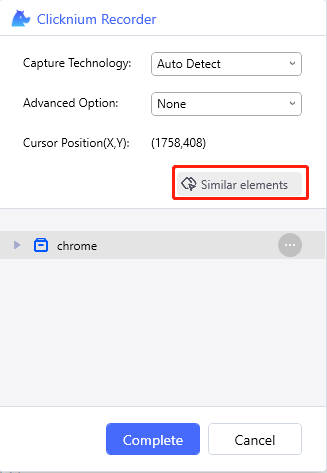
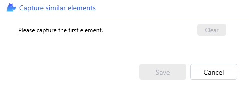
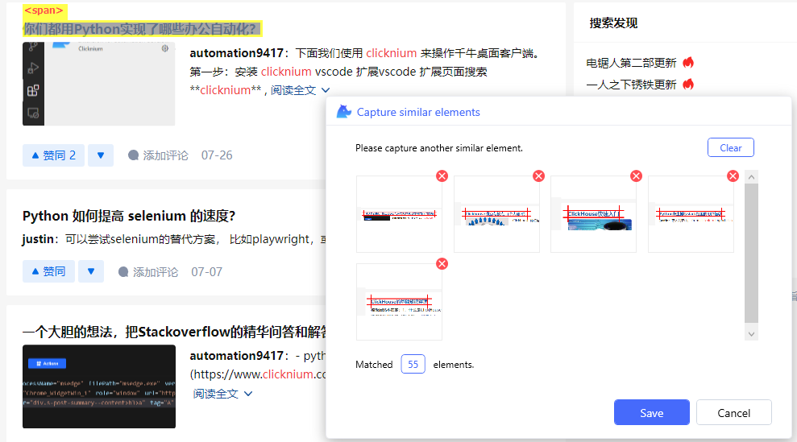

# 知乎自动化sample集合

**[clicknium](https://www.clicknium.com/)** 是基于 python 实现的一套 免费的UI 自动化的库，功能强大、简单易用，可以用来操作桌面、 web 、 java 、 sap 等应用。clicknium 相比于其他的自动化库，使用更简单，相比于大家熟知的 selenium，**[clicknium](https://www.clicknium.com/)** 上手更简单，页面元素的定位不需要人工再去写 xpath ，**内置的录制器录制一下页面元素控件就会自动生成选择器，同时 clicknium 还支持桌面应用**，在实现复杂混合web和桌面应用自动化场景中，可以无缝衔接；

## search
简单起见，没有做登录那一块，会涉及滑块验证码或者手机验证码，后续可以提供。

- 首先根据url绑定已经打开的浏览器
```python
tab = cc.chrome.attach_by_title_url(url="https://www.zhihu.com/*")
```

- 通过当前页面跳转，直接搜索关键词
```python
tab.goto("https://www.zhihu.com/search?type=content&q=clicknium")
```

- 等待搜索结果出现
```python
tab.wait_appear(locator.chrome.zhihu.span_title)
```

- 因为搜索结果页面是动态加载的，为了显示更多的搜索结果，可以连续滚动当前页面多次
```
for _ in range(10):
    tab.scroll(delta_y=5000)
    sleep(0.2)
```
因为页面是动态加载的，所以每次滚动一定距离之后，sleep 200毫秒，等待新的结果加载出来，然后才可以继续滚动滚动条

- 录制相似元素
启动Clicknium Recorder之后依次按照以下操作





多次指定结果标题（tag是SPAN）


录制产生的locator如下


- 通过相似元素获取多个结果项
```python
elems = tab.find_elements(locator.chrome.zhihu.span_title)
```

- 遍历得到的元素列表
这里通过获取parent元素（tag为a的元素）的属性href，可以获取到每个结果的url。

```python
for elem in elems:
    print(elem.get_text())
    print(elem.parent.get_property("href"))
```

